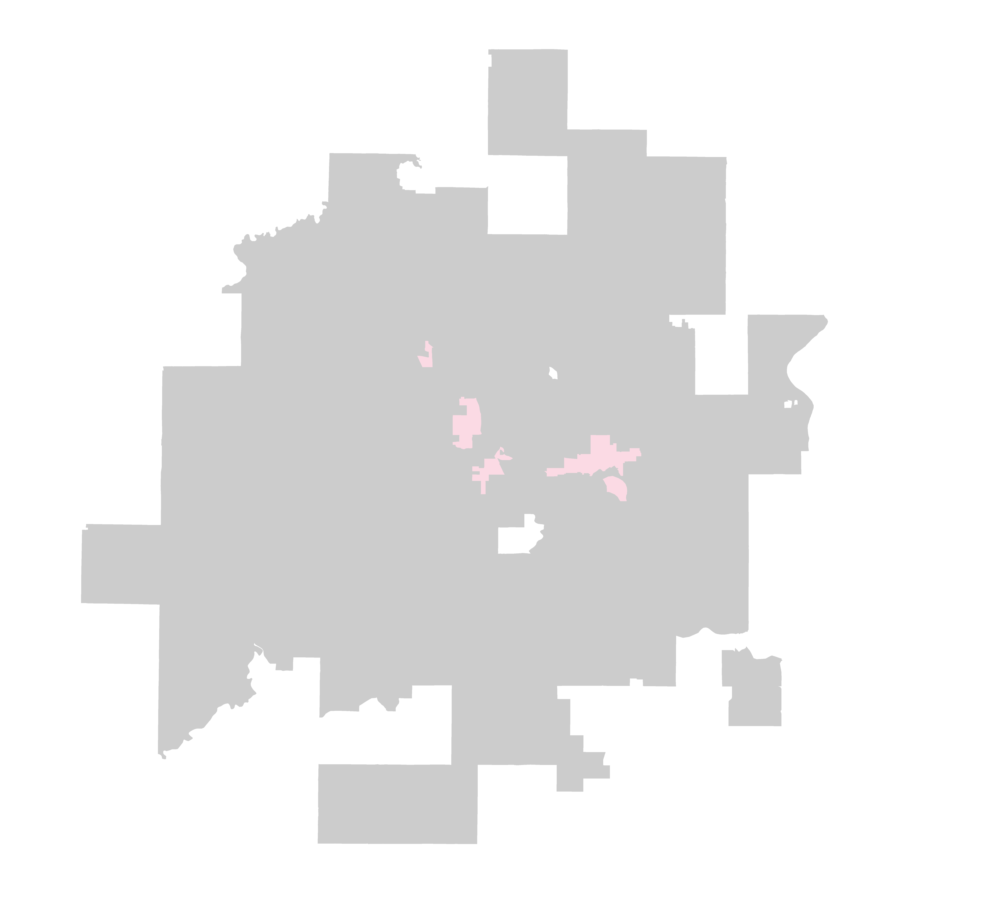
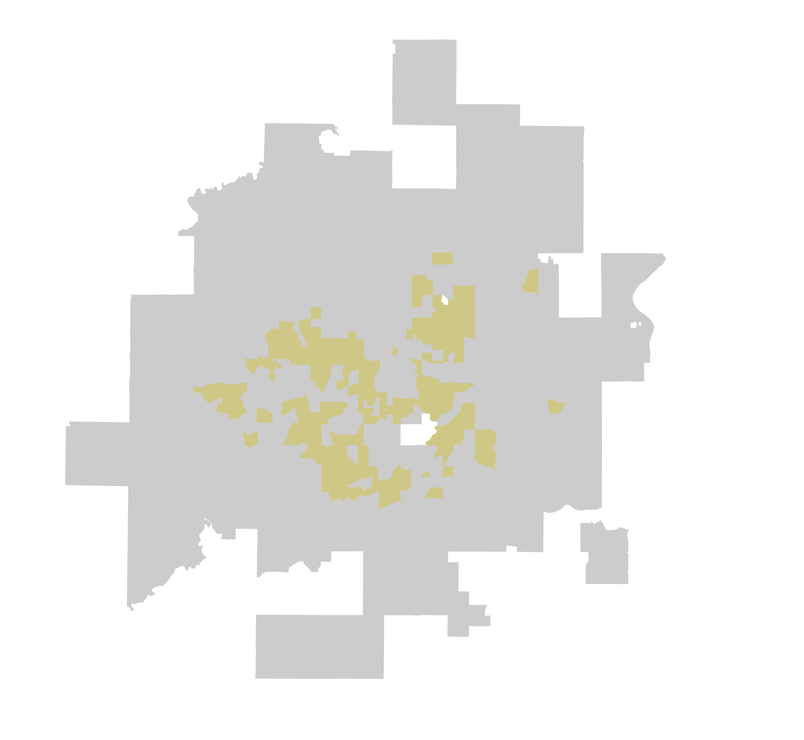

 
 

<b> <h1>What makes a type?</h1> </b></strong>
 

 A type is a group of census tracts in the Twin Cities region that have shared similar trends of demographic, built environment, and housing market changes from 2000 through 2017.

 

 [More about the study and methodology](https://sullivannicole.github.io/Suburban-Change/background.html) 

---------------------

<b> <h1>Types</h1> </b>

 
 

 

 
Established communities of color, lowest income over time, limited construction, most affordable housing stock, increasing rents.

   

<h3> Trends </h3>
 <ul>
<li>Trend 1</li>
<li>Trend 2</li>
<li>Trend 3</li>
</ul>

<h3> Strategies </h3>
 <ul>
<li>Strategy 1</li>
<li>Strategy 2</li>
</ul>

 

 
Jurisdictions with high and rapidly increasing diversity, income low but increasing, rents low but increasing

   

<h3> Trends </h3>
 <ul>
<li>Trend 1</li>
<li>Trend 2</li>
<li>Trend 3</li>
</ul>

<h3> Strategies </h3>
 <ul>
<li>Strategy 1</li>
<li>Strategy 2</li>
</ul>

 

 
Jurisdictions with a steady inflow of people of color over time, moderate incomes, affordable housing stock, and rents that increased after the recession
 

   

<h3> Strategies </h3>
 <ul>
<li>Senior Housing</li>
<li>Age-Friendly Communities</li>
<li>Housing Stock Preservation</li>
<li>Sense of Community</li>
<li>Racial Equity</li>
</ul>

 

 
Established communities of color, lowest income over time, limited construction, most affordable housing stock, increasing rents.

   

<h3> Trends </h3>
 <ul>
<li>Trend 1</li>
<li>Trend 2</li>
<li>Trend 3</li>
</ul>

<h3> Strategies </h3>
 <ul>
<li>Strategy 1</li>
<li>Strategy 2</li>
</ul>

 

 
Established communities of color, lowest income over time, limited construction, most affordable housing stock, increasing rents.

   

<h3> Trends </h3>
 <ul>
<li>Trend 1</li>
<li>Trend 2</li>
<li>Trend 3</li>
</ul>

<h3> Strategies </h3>
 <ul>
<li>Strategy 1</li>
<li>Strategy 2</li>
</ul>

 

 
Established communities of color, lowest income over time, limited construction, most affordable housing stock, increasing rents.

   

<h3> Trends </h3>
 <ul>
<li>Trend 1</li>
<li>Trend 2</li>
<li>Trend 3</li>
</ul>

<h3> Strategies </h3>
 <ul>
<li>Strategy 1</li>
<li>Strategy 2</li>
</ul>

 

 
Established communities of color, lowest income over time, limited construction, most affordable housing stock, increasing rents.

   

<h3> Trends </h3>
 <ul>
<li>Trend 1</li>
<li>Trend 2</li>
<li>Trend 3</li>
</ul>

<h3> Strategies </h3>
 <ul>
<li>Strategy 1</li>
<li>Strategy 2</li>
</ul>

