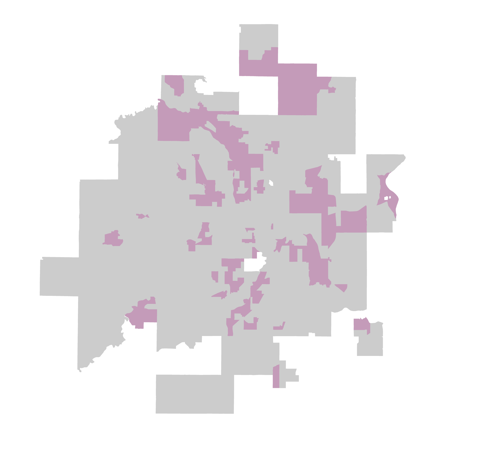

```{r setup, include=FALSE}
knitr::opts_chunk$set(echo = TRUE)
```
<br>
<br>
<center><b> <h1>What is a typology?</h1> </b></strong>
<br>
<center> A typology is a group of census tracts in the Twin Cities region that have shared similar trends of demographic, built environment, and housing market changes from 2000 through 2017.</center>
<br>
<center> [More about the study and methodology](https://sullivannicole.github.io/Suburban-Change/background.html) </center>

---------------------
<b> <h1>Typologies</h1> </b>
<br>
<br>
<div class = "wrapper">
<div class = "map-a">

</div>

<div class = "container-a">
<div class = "paragraph-a"> 
[](https://sullivannicole.github.io/Suburban-Change/typology-a.html)
<br>
<br>
<br>
dulce et decorum est.
</div>
   
<div class = "column-a-issues">
<h3> Issues </h3>
<br><ul>
  * Issue 1
  * Issue 2
  * Issue 3
</ul>
</div>

  <div class = "column-a-jurisdictions">
<h3> Jurisdictions </h3>
<br><ul>
  * Jurisdiction 1
  * Jurisdiction 2
</ul>
  </div>
</div>

<hr size="5" color="grey">

<div class = "map-b">

</div>
<div class = "container-b">
<div class = "paragraph-b">
[](https://sullivannicole.github.io/Suburban-Change/typology-b.html)
<br>
<br>
<br>
dulce et decorum est.
</div>
   
<div class = "column-b-issues">
<h3> Issues </h3>
<br><ul>
  * Issue 1
  * Issue 2
  * Issue 3
</ul>
</div>

  <div class = "column-b-jurisdictions">
<h3> Jurisdictions </h3>
<br><ul>
  * Jurisdiction 1
  * Jurisdiction 2
</ul>
  </div>
</div>
<br>
<br>

<div class = "map-c">

</div>
<div class = "container-c">
<div class = "paragraph-c">
[](https://sullivannicole.github.io/Suburban-Change/typology-c.html)
<br>
<br>
<br>
dulce et decorum est.
</div>
   
<div class = "column-c-issues">
<h3> Issues </h3>
<br><ul>
  * Issue 1
  * Issue 2
  * Issue 3
</ul>
</div>

  <div class = "column-c-jurisdictions">
<h3> Jurisdictions </h3>
<br><ul>
  * Jurisdiction 1
  * Jurisdiction 2
</ul>
  </div>
</div>
<br>
<br>

<div class = "map-d">

</div>
<div class = "container-d">
<div class = "paragraph-d">
[](https://sullivannicole.github.io/Suburban-Change/typology-d.html)
<br>
<br>
<br>
dulce et decorum est.
</div>
   
<div class = "column-d-issues">
<h3> Issues </h3>
<br><ul>
  * Issue 1
  * Issue 2
  * Issue 3
</ul>
</div>

  <div class = "column-d-jurisdictions">
<h3> Jurisdictions </h3>
<br><ul>
  * Jurisdiction 1
  * Jurisdiction 2
</ul>
  </div>
</div>
<br>
<br>

<div class = "map-e">

</div>
<div class = "container-e">
<div class = "paragraph-e">
[](https://sullivannicole.github.io/Suburban-Change/typology-e.html)
<br>
<br>
<br>
dulce et decorum est.
</div>
   
<div class = "column-e-issues">
<h3> Issues </h3>
<br><ul>
  * Issue 1
  * Issue 2
  * Issue 3
</ul>
</div>

  <div class = "column-e-jurisdictions">
<h3> Jurisdictions </h3>
<br><ul>
  * Jurisdiction 1
  * Jurisdiction 2
</ul>
  </div>
</div>
<br>
<br>

<div class = "map-f">

</div>
<div class = "container-f">
<div class = "paragraph-f">
[](https://sullivannicole.github.io/Suburban-Change/typology-f.html)
<br>
<br>
<br>
dulce et decorum est.
</div>
   
<div class = "column-f-issues">
<h3> Issues </h3>
<br><ul>
  * Issue 1
  * Issue 2
  * Issue 3
</ul>
</div>

  <div class = "column-f-jurisdictions">
<h3> Jurisdictions </h3>
<br><ul>
  * Jurisdiction 1
  * Jurisdiction 2
</ul>
  </div>
</div>
<br>
<br>

<div class = "map-g">

</div>
<div class = "container-g">
<div class = "paragraph-g">
[](https://sullivannicole.github.io/Suburban-Change/typology-g.html)
<br>
<br>
<br>
dulce et decorum est.
</div>
   
<div class = "column-g-issues">
<h3> Issues </h3>
<br><ul>
  * Issue 1
  * Issue 2
  * Issue 3
</ul>
</div>

  <div class = "column-g-jurisdictions">
<h3> Jurisdictions </h3>
<br><ul>
  * Jurisdiction 1
  * Jurisdiction 2
</ul>
  </div>
</div>

</div>


