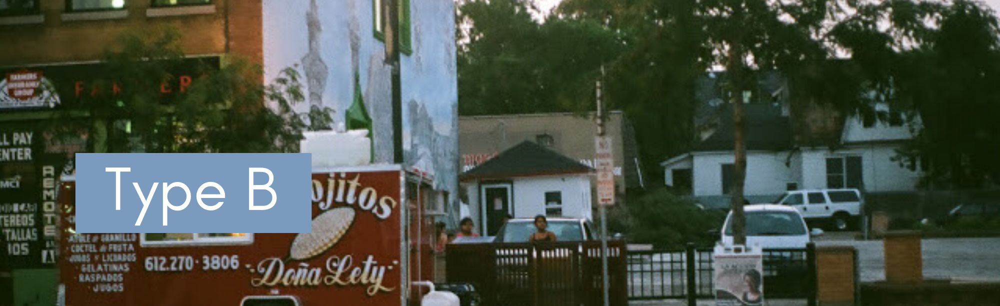
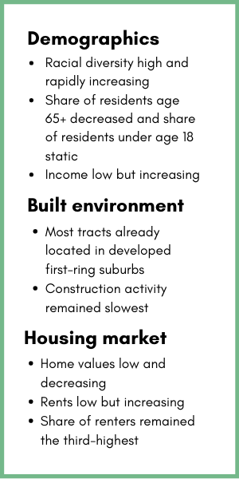

<style type="text/css">
.main-container {
  max-width: 100%;
  margin-left: 0;
  margin-right: 0;
  padding: 0;
}
img{
width: 100vw;
}
</style>

<script src="js/code_folding.js"></script>




<div class = "typology-container">
<div class = "typology-text">
Type B tracts are mostly located in older, inner-ring suburban areas such Columbia Heights, Fridley, Brooklyn Center, Brooklyn Park, Roseville, Richfield and Bloomington with a few exceptions in outer suburbs such as Shakopee, Savage, Apple Valley and Eagan. Geographically, most of these tracts are either adjacent or nearby Type A areas, which they closely resemble. 
<br>
<br>
The racial and economic characteristics of Type B tracts distinguish them from all other types of tracts except for Type A tracts. Type B tracts have the second highest percentage of people of color in the study area—second only to Type A tracts. The percentage of people of color in Type B tracts have been increasing more rapidly than any other type of tract. Type B tracts also have the some of the highest percentage of residents in poverty after Type A tracts.
<br>
<br>
Despite resembling Type A tracts, Type B tracts differ from Type A areas in terms of their demographic trends. In fact, demographic trends in Type B tracts stand out in the study area. Unlike every other type in the study area where the percentage of school-age children have declined, in Type B tracts this percentage has stayed mostly the same. Similarly, the percentage of residents 65 years or older in Type B tracts declined, in contrast to the study area, where the same percentage increased.
<br>
<br>
Having developed earlier, Type B areas have an older and more affordable housing stock. Median home values in Type B tracts are lower than those in all tract types except for Type A. Housing markets in both Type B and F tracts stand out in the study area in that they haven’t yet bounced back since the recession. In fact, while median home values have increased during the 2010s in the study area, they have continued to decline in both Type B and A tracts. Type B areas has had the lowest amount of construction activity in the study area. 
<br>
<br>
Planning needs of Type B census tracts are likely to change as the demographics of their residents change. Growing racial and cultural diversity can present new opportunities for these tracts. For instance, place-making investments, such as public spaces and artist programs, that aim to create culture-specific hubs can capitalize on the cultural assets of these census tracts. Changing preferences and the needs of the residents might also require different type of investments. For instance, retooling existing recreational facilities to build soccer fields as well as baseball diamonds may be one way of accommodating resident demand.
<br>
<br>
If the trends in declining median home values persist, Type B census tracts might face the risk of deterioration. Maintaining the quality of housing is essential for fending off this risk. Since these census tracts have modest incomes and high poverty, they might face issues related to deferred maintenance. Housing rehabilitation, maintenance, and weatherization programs might help residents catch up with deferred maintenance and enable home improvements necessary to maintain the quality of housing in Type B tracts.
<br>
<br>
</div>

<div class = "typology-stats">

  </div>
</div>

<div class = "typology-viz-container">
<div class = "typology-viz">
<div class = "viz-header" style = "padding-bottom: 20px"><b><h2> Geography </h2></b></div>
<iframe src="https://public.tableau.com/views/B_15726726747110/ClusterE?:embed=y&:display_count=yes&:showVizHome=no!:origin=viz_share_link" width = "100%" height = "700" frameBorder = "0" ></iframe>
</div>
</div>

<div class = "issues-strategies">
<b><h2> Issues + Strategies </h2></b>

dulce et decorum est. dulce et decorum est. dulce et decorum est. <br>
dulce et decorum est. dulce et decorum est. dulce et decorum est.

----------------

<b><h3> Issue1 </b></h3>
dulce et decorum est. dulce et decorum est. dulce et decorum est. <br>
dulce et decorum est. dulce et decorum est. dulce et decorum est.

<b><h3>Strategies</b></h3>
<h4>Strategy1</h4>

```{fold, class.source = "fold-chunk"}
dulce et decorum est
dulce et decorum est
dulce et decorum est
dulce et decorum est
dulce et decorum est

```

<h4>Strategy2</h4>
```{fold, class.source = "fold-chunk"}
dulce et decorum est
dulce et decorum est
dulce et decorum est
dulce et decorum est
dulce et decorum est
dulce et decorum est

```

<b><h3> Issue2 </b></h3>
dulce et decorum est. dulce et decorum est. dulce et decorum est. <br>
dulce et decorum est. dulce et decorum est. dulce et decorum est.

<b><h3>Strategies</b></h3>
<h4>Strategy1</h4>

```{fold, class.source= "fold-chunk"}
dulce et decorum est
dulce et decorum est
dulce et decorum est
dulce et decorum est
dulce et decorum est
```

<h4>Strategy2</h4>
```{fold, class.source = "fold-chunk"}
dulce et decorum est
dulce et decorum est
dulce et decorum est
dulce et decorum est
dulce et decorum est
```


-----------------

</div>


